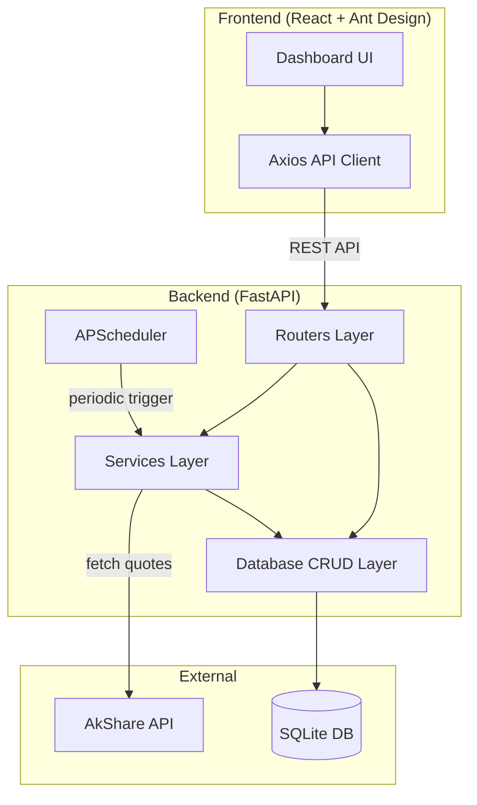

## Product Overview

StockTracker is a full-stack stock tracking application that allows users to monitor China A-share market stocks in real time. It consists of a Python backend that fetches and stores stock data, and a modern web frontend that displays the data in a clean, interactive dashboard.

## Core Features

- **Ticker Management**: Users can add, remove, and view stock tickers (starting with China A-share market; architecture ready for HK and US markets later)
- **Comprehensive Stock Data Storage**: Each ticker stores current price, open/high/low/close, volume, turnover, change percentage, market cap, P/E ratio, and other key fundamentals in a local SQLite database
- **Background Data Refresh**: A configurable background scheduler periodically fetches the latest data from AkShare and updates the database. Refresh interval is user-configurable via a config file
- **Web Dashboard**: A responsive frontend displays all tracked stocks in a sortable, filterable table with key metrics, color-coded price changes, and auto-refresh capability
- **Local & Remote Deployment**: Runs locally on macOS with no extra server installation; deployable to a remote server via Docker or direct process management

## Tech Stack

### Backend

- **Language**: Python 3.11+
- **Web Framework**: FastAPI (async, auto-generated API docs at `/docs`, high performance)
- **ORM**: SQLAlchemy 2.0 with async support (clean DB abstraction, easy future migration to PostgreSQL)
- **Database**: SQLite (zero-config, file-based, perfect for local dev)
- **Data Source**: AkShare (free, open-source, excellent China A-share coverage)
- **Background Scheduler**: APScheduler (mature, configurable interval scheduling)
- **Config**: YAML config file via PyYAML
- **Server**: Uvicorn (ASGI server, no extra web server needed locally)

### Frontend

- **Framework**: React 18 + TypeScript
- **Build Tool**: Vite (fast HMR, optimized builds)
- **Component Library**: Ant Design (rich table/data components, professional look, great for data-heavy dashboards)
- **HTTP Client**: Axios
- **Styling**: Ant Design built-in + CSS Modules for custom styles

## Implementation Approach

The application follows a clean layered architecture:

1. **Backend** is organized into distinct layers: routers (HTTP endpoints) -> services (business logic & data fetching) -> database (models, CRUD, session management), with Pydantic schemas for validation at each boundary.

2. **Background scheduler** runs as an in-process APScheduler job that starts with the FastAPI application lifecycle. It iterates over all tracked tickers, calls AkShare to fetch latest quotes, and performs batch upserts into SQLite. The refresh interval is read from `config.yaml` and can be changed at runtime via API.

3. **Frontend** is a single-page React app that communicates with the backend via REST API. It displays stocks in an Ant Design Table with sorting, filtering, and auto-refresh (polling the backend at a configurable interval). The frontend is served as static files by FastAPI in production, or via Vite dev server during development.

4. **Deployment**: Locally, a single `run.sh` script starts both backend (uvicorn) and frontend (vite dev). For production, `npm run build` generates static assets that FastAPI serves directly, so only one process (uvicorn) is needed.

### Key Technical Decisions

- **FastAPI over Flask**: Native async support, automatic OpenAPI docs, Pydantic validation — better developer experience and performance for API-first apps
- **SQLAlchemy 2.0**: Modern async API, clean separation of models and queries, trivial to swap SQLite for PostgreSQL later by changing the connection string
- **APScheduler over custom threading**: Battle-tested, supports cron/interval triggers, graceful shutdown, and job persistence if needed later
- **AkShare `ak.stock_zh_a_spot_em()`**: Returns comprehensive real-time data for all A-shares in one call; we filter by tracked tickers rather than making per-ticker requests (much more efficient)
- **Ant Design over shadcn**: Better out-of-the-box table components with built-in sorting, filtering, and pagination — ideal for a data-heavy stock dashboard with minimal custom CSS

## Implementation Notes

- **Performance**: AkShare's `stock_zh_a_spot_em()` fetches all A-share quotes in a single HTTP request. The scheduler fetches once and filters locally by tracked tickers, avoiding N+1 API calls. SQLite writes are batched in a single transaction per refresh cycle.
- **Error handling**: The scheduler wraps each fetch cycle in try/except to prevent crashes from transient network errors. Failed fetches are logged with timestamps; stale data is preserved in DB until the next successful refresh.
- **CORS**: FastAPI middleware configured to allow the Vite dev server origin (`localhost:5173`) during development.
- **Graceful shutdown**: APScheduler is registered with FastAPI's lifespan events so it shuts down cleanly when the server stops.
- **Config hot-reload**: The refresh interval can be updated via a PATCH API endpoint, which reschedules the APScheduler job without restart.
- **Market hours awareness**: The scheduler can optionally skip fetches outside China market hours (9:30-15:00 CST) to avoid unnecessary API calls, configurable via `config.yaml`.

## Architecture Design



### Data Flow

1. **User adds ticker** -> Frontend POST `/api/stocks` -> Router -> CRUD inserts ticker into DB
2. **Scheduler fires** -> Calls AkShare `stock_zh_a_spot_em()` -> Filters tracked tickers -> Batch upserts data into DB
3. **Frontend polls** -> GET `/api/stocks` -> Router -> CRUD reads all stocks -> Returns JSON -> Table renders with latest data

## Directory Structure

```
StockTracker/
├── backend/
│   ├── app/
│   │   ├── __init__.py          # [NEW] Package init
│   │   ├── main.py              # [NEW] FastAPI application entry point. Configures CORS, registers routers, mounts static files (production), and manages application lifespan (start/stop APScheduler). Serves as the single entry point for uvicorn.
│   │   ├── config.py            # [NEW] Configuration management. Loads config.yaml using PyYAML, provides a Settings dataclass with fields: db_url, refresh_interval_seconds, market_hours_only, cors_origins. Validates config on startup.
│   │   ├── database/
│   │   │   ├── __init__.py      # [NEW] Package init, exports engine/session
│   │   │   ├── models.py        # [NEW] SQLAlchemy ORM models. Defines Stock model with columns: id, symbol, name, current_price, open, high, low, close, volume, turnover, change_percent, market_cap, pe_ratio, pb_ratio, turnover_rate, fifty_two_week_high, fifty_two_week_low, updated_at, created_at. Uses proper column types and indexes on symbol.
│   │   │   ├── session.py       # [NEW] Database session management. Creates async SQLAlchemy engine and sessionmaker for SQLite. Provides get_db dependency for FastAPI injection. Handles DB file creation and table initialization on startup.
│   │   │   └── crud.py          # [NEW] CRUD operations. Implements: get_all_stocks, get_stock_by_symbol, add_stock, remove_stock, batch_update_stock_data. Uses parameterized queries via SQLAlchemy (no raw SQL concatenation). Returns model instances.
│   │   ├── routers/
│   │   │   ├── __init__.py      # [NEW] Package init
│   │   │   └── stocks.py        # [NEW] Stock API endpoints. GET /api/stocks (list all), POST /api/stocks (add ticker by symbol), DELETE /api/stocks/{symbol} (remove ticker), GET /api/stocks/{symbol} (get single), PATCH /api/config (update refresh interval). All endpoints use Pydantic schemas for request/response validation.
│   │   ├── services/
│   │   │   ├── __init__.py      # [NEW] Package init
│   │   │   ├── stock_fetcher.py # [NEW] AkShare data fetching service. Implements fetch_all_cn_stocks() that calls ak.stock_zh_a_spot_em(), transforms DataFrame columns to match our model fields, and returns a dict keyed by symbol. Handles AkShare exceptions and logs errors. Provides map_akshare_row_to_dict() for field mapping.
│   │   │   └── scheduler.py     # [NEW] Background scheduler service. Initializes APScheduler AsyncIOScheduler. Implements refresh_stock_data() job: fetches all quotes via stock_fetcher, filters by tracked tickers from DB, batch-updates DB. Provides start_scheduler(), stop_scheduler(), and update_interval() functions. Respects market_hours_only config.
│   │   └── schemas/
│   │       ├── __init__.py      # [NEW] Package init
│   │       └── stock.py         # [NEW] Pydantic schemas. Defines StockCreate (symbol: str), StockResponse (all fields including computed ones), StockListResponse (list wrapper with count), ConfigUpdate (refresh_interval: int). All schemas use model_config for ORM mode.
│   ├── requirements.txt         # [NEW] Python dependencies: fastapi, uvicorn[standard], sqlalchemy[asyncio], aiosqlite, akshare, apscheduler, pyyaml, httpx
│   └── config.yaml              # [NEW] Application configuration: refresh_interval_seconds (default 30), market_hours_only (default false), cors_origins, database path
├── frontend/
│   ├── public/
│   │   └── favicon.ico          # [NEW] App favicon
│   ├── src/
│   │   ├── main.tsx             # [NEW] React app entry point. Renders App component with Ant Design ConfigProvider.
│   │   ├── App.tsx              # [NEW] Root component. Sets up layout with header, main content area, and footer. Manages global state for stock list and polling interval.
│   │   ├── components/
│   │   │   ├── StockTable.tsx   # [NEW] Main stock data table component. Uses Ant Design Table with sortable columns for all stock fields. Color-codes positive (red for CN convention) and negative (green) changes. Supports column visibility toggle and responsive layout.
│   │   │   ├── AddStockModal.tsx # [NEW] Modal dialog for adding a new ticker. Input field for stock symbol with validation (6-digit format for CN stocks). Calls POST API on submit. Shows success/error feedback.
│   │   │   ├── StockCard.tsx    # [NEW] Compact card view for a single stock. Shows symbol, name, price, change% with color coding. Used in mobile/grid view mode as alternative to table.
│   │   │   └── Header.tsx       # [NEW] App header with logo/title, "Add Stock" button, refresh status indicator, and settings dropdown (toggle auto-refresh, change poll interval).
│   │   ├── services/
│   │   │   └── api.ts           # [NEW] Axios API client. Configures base URL. Exports: fetchStocks(), addStock(symbol), removeStock(symbol), updateConfig(). Handles error responses and returns typed data.
│   │   ├── types/
│   │   │   └── stock.ts         # [NEW] TypeScript type definitions. Defines Stock interface matching backend StockResponse, ApiResponse wrapper type, Config type.
│   │   ├── hooks/
│   │   │   └── useStocks.ts     # [NEW] Custom React hook for stock data management. Implements polling with configurable interval using useEffect + setInterval. Provides stocks, loading, error states and add/remove actions.
│   │   └── styles/
│   │       └── index.css        # [NEW] Global styles and Ant Design overrides. Custom styles for price change colors, table density, responsive breakpoints.
│   ├── index.html               # [NEW] HTML entry point for Vite
│   ├── package.json             # [NEW] Dependencies: react, react-dom, antd, axios, @ant-design/icons. DevDeps: typescript, @types/react, vite, @vitejs/plugin-react
│   ├── tsconfig.json            # [NEW] TypeScript configuration
│   └── vite.config.ts           # [NEW] Vite config with proxy to backend (localhost:8000) for dev, build output to ../backend/static for production
├── run.sh                       # [NEW] Startup script. Activates Python venv, starts uvicorn in background, starts vite dev server. Handles SIGINT to stop both. Usage instructions in comments.
├── run_prod.sh                  # [NEW] Production startup. Builds frontend, copies to backend/static, starts uvicorn serving both API and static files on a single port.
├── .gitignore                   # [NEW] Ignores: __pycache__, node_modules, *.db, .venv, dist, .env
└── README.md                    # [NEW] Project documentation. Setup instructions (Python venv, pip install, npm install), development usage, production deployment guide, configuration reference, API documentation overview.
```

## Key Code Structures

### Stock SQLAlchemy Model

```python
class Stock(Base):
    __tablename__ = "stocks"

    id: Mapped[int] = mapped_column(primary_key=True, autoincrement=True)
    symbol: Mapped[str] = mapped_column(String(10), unique=True, index=True, nullable=False)
    name: Mapped[Optional[str]] = mapped_column(String(50))
    current_price: Mapped[Optional[float]] = mapped_column(Float)
    open_price: Mapped[Optional[float]] = mapped_column(Float)
    high_price: Mapped[Optional[float]] = mapped_column(Float)
    low_price: Mapped[Optional[float]] = mapped_column(Float)
    close_price: Mapped[Optional[float]] = mapped_column(Float)
    volume: Mapped[Optional[int]] = mapped_column(BigInteger)
    turnover: Mapped[Optional[float]] = mapped_column(Float)
    change_percent: Mapped[Optional[float]] = mapped_column(Float)
    market_cap: Mapped[Optional[float]] = mapped_column(Float)
    pe_ratio: Mapped[Optional[float]] = mapped_column(Float)
    pb_ratio: Mapped[Optional[float]] = mapped_column(Float)
    turnover_rate: Mapped[Optional[float]] = mapped_column(Float)
    updated_at: Mapped[Optional[datetime]] = mapped_column(DateTime, onupdate=func.now())
    created_at: Mapped[datetime] = mapped_column(DateTime, server_default=func.now())
```

### Pydantic Response Schema

```python
class StockResponse(BaseModel):
    model_config = ConfigDict(from_attributes=True)

    id: int
    symbol: str
    name: str | None
    current_price: float | None
    open_price: float | None
    high_price: float | None
    low_price: float | None
    close_price: float | None
    volume: int | None
    turnover: float | None
    change_percent: float | None
    market_cap: float | None
    pe_ratio: float | None
    pb_ratio: float | None
    turnover_rate: float | None
    updated_at: datetime | None
    created_at: datetime
```

## Design Style

A professional, data-centric financial dashboard with a clean dark-on-light design. The interface prioritizes information density and readability, drawing inspiration from modern fintech applications like TradingView and Bloomberg Terminal (lite version). Uses Ant Design components natively with a custom financial color theme.

## Page Planning

This application has a single-page dashboard design with modal overlays.

### Page 1: Stock Dashboard (Main Page)

**Block 1 - Top Navigation Bar**
Fixed header with app logo (chart icon + "StockTracker" text), real-time clock showing market status (open/closed), an "Add Stock" primary button, and a settings icon dropdown for configuring refresh interval.

**Block 2 - Market Summary Strip**
A horizontal row of compact stat cards showing: total tracked stocks count, market status indicator (trading/closed), last refresh timestamp with countdown to next refresh, and a manual "Refresh Now" button.

**Block 3 - Stock Data Table**
Full-width Ant Design table as the core content area. Columns: Symbol, Name, Price, Change%, Open, High, Low, Volume, Turnover, Market Cap, P/E, P/B. Price and Change% columns use red (positive) and green (negative) following China market convention. Rows are hoverable with subtle highlight. Supports column sorting and filtering. Each row has a delete action button (icon) on the far right. Empty state shows an illustration with "Add your first stock" prompt.

**Block 4 - Footer**
Minimal footer with data source attribution ("Data provided by AkShare"), app version, and a link to the API documentation (/docs).

### Modal: Add Stock

Centered modal overlay with a search input for stock symbol (with format hint "e.g., 600519"), a submit button, and inline validation feedback. On success, the modal closes and the new stock appears in the table.

## Agent Extensions

### Skill

- **writing-plans**
- Purpose: Structure and validate the multi-step implementation plan before coding begins, ensuring each task is well-defined and sequenced
- Expected outcome: A verified, ordered implementation plan with clear dependencies and milestones

- **frontend-design**
- Purpose: Generate the production-grade React frontend with high design quality, ensuring the stock dashboard is visually polished and professional
- Expected outcome: A distinctive, well-styled financial dashboard UI that avoids generic AI aesthetics

### SubAgent

- **code-explorer**
- Purpose: During implementation, verify file structures and cross-module dependencies as the codebase grows
- Expected outcome: Accurate verification of imports, file paths, and module integration across backend and frontend